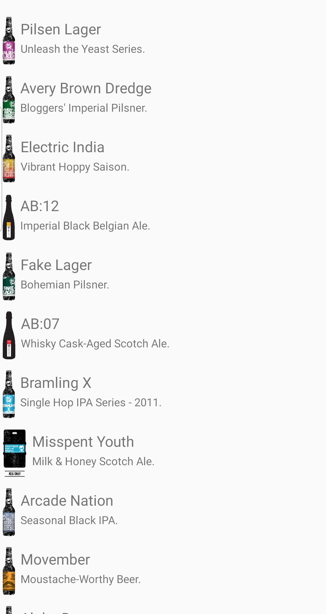
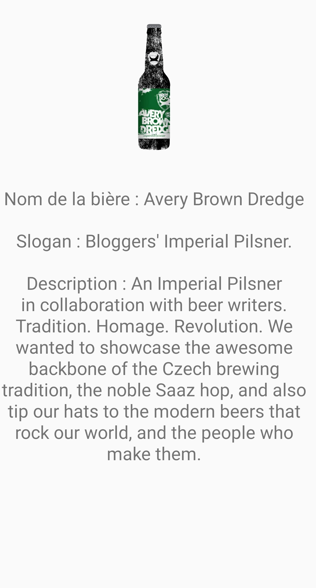

# Application Bière

## Présentation

Simple projet réalisant un appel API avec une architecture MVC.

Cette application affiche une liste de bière.

## Prérequis


- Installation d'Android Studio


````
https://github.com/CharlesMaziarski/Beers.git
````

## Consignes respectées : 

- MVC Architecture
- Appels REST
- Ecrans : 2 activités
- Affichage d'une liste dans un RecyclerView
- Affichage du détail d'un item de la liste

## Fonctionnalités: 

### Premier écran 

### Ecran Home 

- Affiche la liste des bières.

  

### Ecran du détail de la bière

- Affiche les différentes informations sur la bière :
  - Nom de la bière
  - Slogan de la bière
  - Description de la bière





